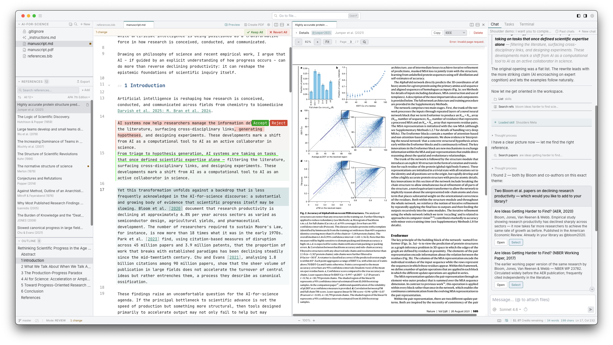

# Shoulders

> *"If I have seen further, it is by standing on the shoulders of giants."*<br>
> – Isaac Newton, 1675 (echoing Bernard of Chartres, c. 1120)

The AI Workspace for Researchers. Writing, reference management, and coding, combined with truly capable AI assistance.

## Screenshot




## tl;dr:

Shoulders is a local-first document editor for researchers. It has multi-provider AI assistance (Anthropic, OpenAI, Google) and version control; handles Markdown (compiled to PDF with Typst), LaTeX (compiled with Tectonic), DOCX (via SuperDoc), as well as code (e.g. R, Python, Jupyter); and has a built-in reference management system.


## Features

- **Multi-format editing** — Edit Markdown, LaTeX, DOCX, Jupyter notebooks, CSV, and code files side by side in a resizable, splittable pane interface with tabbed browsing.
- **Integrated AI assistance** — Inline ghost text completions (triggered with `++`), context-aware chat sidebar, and task threads powered by Anthropic, OpenAI, and Google models; switch providers mid-conversation.
- **Task agents & inline edit review** — Select any text to start a threaded task with AI and apply safe, reviewable AI edit suggestions via inline diff overlays.
- **Reference management** — Built-in CSL-JSON reference library with DOI/BibTeX/PDF import, smart autocomplete for Pandoc citations, and drag-and-drop PDF metadata extraction.
- **Git version control** — Automatic and manual commits, full file history browser, inline comparison and one-click restore, designed for researchers with less git experience.
- **Embedded terminal & code execution** — Persistent xterm.js terminals (multi-tab), built-in R/Python/Julia REPLs, Jupyter kernel—run code and manage workflows without leaving the app.
- **PDF and notebook support** — Native PDF viewer with search, selection, and annotation; open, edit, and execute Jupyter `.ipynb` notebooks directly in the workspace.
- **Customizable UI & privacy first** — Multiple themes, fully local by default, works offline, all files are plain-text and stored on your own machine (no vendor lock-in).

## Architecture

```
Tauri v2 Shell
  Rust Backend (src-tauri/)
    fs_commands.rs  — File I/O, git, file watching, API proxy, content search
    pty.rs          — Terminal sessions via portable-pty
    chat.rs         — AI streaming proxy (SSE via reqwest + tokio)
    lib.rs          — App setup, state management, command registration

  Vue 3 Frontend (src/)
    stores/         — Pinia: workspace, files, editor, chat, reviews, tasks
    services/       — AI providers, chat orchestration, git, references, system prompt
    editor/         — CodeMirror 6: setup, theme, ghost suggestions, diff overlay, tasks, wiki links
    components/     — Vue components: layout, sidebar, editor, right panel, modals
```

Desktop shell is Tauri v2 (Rust + webview). All file operations and API calls go through custom Rust commands — no browser filesystem access, no CORS issues. The frontend is Vue 3 + Pinia + Tailwind CSS 3.

## Prerequisites

- **Bun** — install from [bun.sh](https://bun.sh)
- **Node.js** (v25+) — required by Tauri's build toolchain
- **Rust** — install via [rustup](https://rustup.rs/) if needed:
  ```bash
  curl --proto '=https' --tlsv1.2 -sSf https://sh.rustup.rs | sh
  ```
- **API key** (optional) — AI features require an Anthropic, OpenAI, or Google API key. Configure in Settings after launch.

## Build and Run

```bash
bun install
bunx tauri dev          # Development (hot-reload)
bunx tauri build        # Production build
```

If `cargo` isn't found, add the Rust toolchain to your PATH:
```bash
export PATH="$HOME/.cargo/bin:$PATH"
```

## Web Backend

The `web/` directory contains an optional Nuxt 3 backend that powers the Shoulders website and backend server at shoulde.rs. It is not required to build or run the desktop app.


### Peer Review (preview feature)

The peer review feature (`/review`) requires **Typst** for PDF export:
```bash
# Ubuntu
sudo snap install typst

# macOS
brew install typst
```

See [`docs/web-peer-review.md`](docs/web-peer-review.md) for full documentation.


## Application Guide

See [`shoulde.rs/docs`](https://shoulde.rs/docs) for a comprehensive user manual.


## Code Documentation

See [`docs/_MAP.md`](docs/_MAP.md) for the central registry of every system, documentation file, and source file in this project.

## Feedback

If you encounter an issue or would like to suggest a new feature, please open an issue at [github.com/shoulders-ai/shoulders/issues](https://github.com/shoulders-ai/shoulders/issues) or contact us at [contact@shoulde.rs](mailto:contact@shoulde.rs).